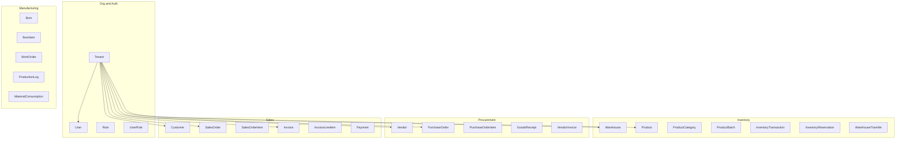

# ERP SaaS Architecture

## Overview

Generic multi-tenant ERP platform. Each tenant (e.g. Reva) is an isolated organization with its own users, products, vendors, customers, and transactions. All business data is scoped by `tenant_id`.

## Domain Model

- **Tenant**: Top-level organization. All entities reference `tenants(id)`.
- **User, Role, UserRole**: Auth and RBAC; roles are per-tenant.
- **Warehouse, Product, ProductCategory, ProductBatch**: Inventory master and stock.
- **InventoryTransaction, InventoryReservation, WarehouseTransfer**: Stock movements and reservations.
- **Vendor, PurchaseOrder, PurchaseOrderItem, GoodsReceipt, VendorInvoice**: Purchase-to-pay.
- **Customer, SalesOrder, SalesOrderItem, Invoice, InvoiceLineItem, Payment**: Quote-to-cash.
- **Bom, BomItem, WorkOrder, ProductionLog, MaterialConsumption**: Manufacturing (BOM, work orders, consumption).

Every business table has `tenant_id UUID NOT NULL REFERENCES tenants(id)` and all API queries filter by the tenant from the JWT.

## Module Boundaries

| Module        | Responsibility                                      | Key APIs                          |
|---------------|-----------------------------------------------------|-----------------------------------|
| **auth**      | Register (tenant + user), Login, JWT                | POST /auth/register, /auth/login  |
| **inventory** | Products, warehouses, stock, batches, transfers     | /api/v1/inventory/*               |
| **purchase**  | Vendors, POs, GRNs, vendor invoices                 | /api/v1/purchase/*                |
| **sales**     | Customers, SOs, invoices, payments                 | /api/v1/sales/*                   |
| **manufacturing** | BOMs, work orders, production logs, consumption | /api/v1/manufacturing/*           |
| **reports**   | Dashboard, exports, scheduled reports               | /api/v1/reports/*                 |
| **reva**      | Tenant-specific (Reva): coil log, stock levels     | /api/v1/reva/*                    |

Auth sets `user_id` and `tenant_id` in JWT; protected routes use `pkg/middleware.JWTProtected()` and read `c.Locals("tenant_id")` to pass into DB layer.

## Data Flow

- **Request** → JWT validated → `tenant_id` and `user_id` in Locals → Handler → sqlc Querier with `tenant_id` in every query.
- **Tenant isolation**: No cross-tenant queries; all list/get/create/update/delete use `tenant_id` from context.

## Stack

- **Backend**: Go, Fiber, sqlc, pgx, PostgreSQL.
- **Frontend**: Next.js, React, Tailwind (erp-frontend).
- **DB**: Single database; tenant isolation by application-enforced `tenant_id` filtering.
