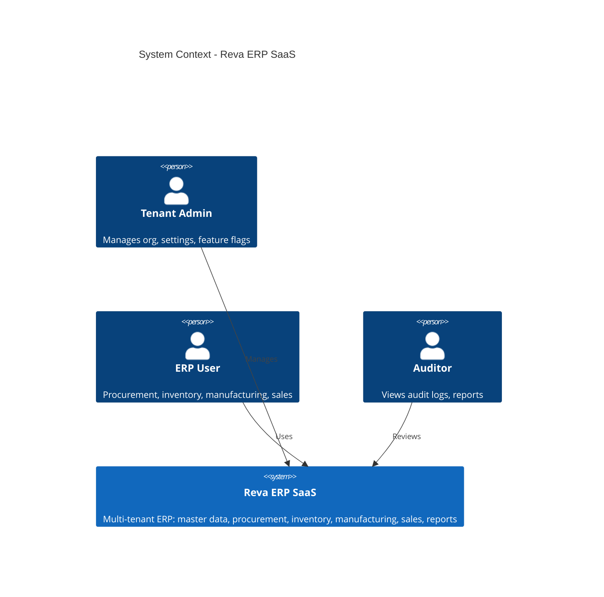
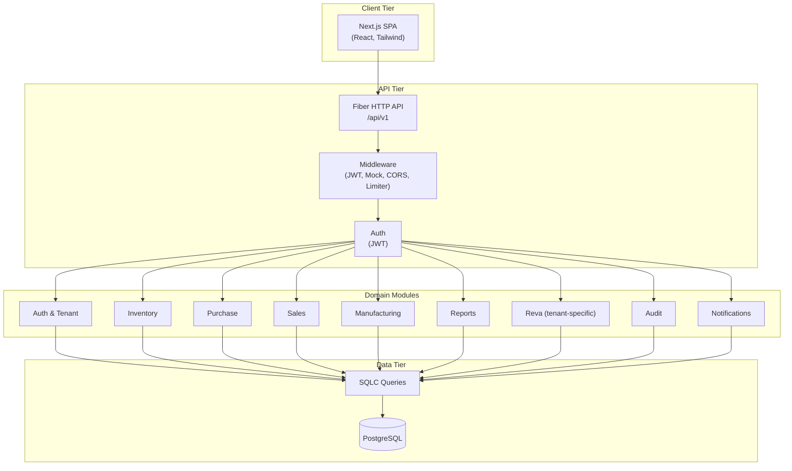

# High-Level Design (HLD) — Reva ERP SaaS Platform

**Version:** 1.0  
**Last updated:** March 2025  
**Status:** Living document

---

## 1. Executive Summary

The **Reva ERP SaaS Platform** is a **multi-tenant ERP** for manufacturing and distribution (reference customer: Reva Technologies Bhopal — stainless steel pipes, metal fabrication). It provides end-to-end coverage from procurement and inventory through manufacturing and sales, with India-specific compliance (GST, TDS), reporting, and audit.

**Design stance:** Modular monolith (Go backend, PostgreSQL, Next.js frontend); no Redis/Kafka in baseline — state and background work use PostgreSQL and in-process logic. The system is built to scale toward 1M users and 100k TPS/hour with read replicas, partitioning, and optional caching.

---

## 2. System Context

### 2.1 Purpose

- **Multi-tenant SaaS:** Each tenant (organization) has isolated data; all entities are scoped by `tenant_id`.
- **Modules:** Auth & org, Master Data (products, vendors, customers), Procurement, Inventory, Manufacturing, Sales, Reports, Administration (audit, settings).
- **Personas:** Tenant admins (company profile, feature flags), procurement/shop-floor/sales users (day-to-day operations), auditors (audit logs).

### 2.2 Context Diagram

### 2.3 External Interfaces (Current / Planned)

| External system       | Direction   | Purpose |
|----------------------|------------|---------|
| PostgreSQL           | Backend ↔ DB | Persistent store; migrations via Goose |
| Browser (Next.js)    | User ↔ App  | SPA; JWT in localStorage / headers |
| (Planned) WhatsApp   | Outbound   | Notifications (module present) |
| (Planned) Payment gateways | Outbound | Invoice payments |

---

## 3. High-Level Architecture

### 3.1 Logical Architecture

### 3.2 Technology Stack

| Layer      | Technology | Notes |
|------------|------------|--------|
| **Backend** | Go 1.x, Fiber v2 | REST API; no server-side sessions |
| **ORM/DB access** | sqlc, pgx/pgxpool | Type-safe SQL; connection pooling |
| **Database** | PostgreSQL | Single primary; read replicas for scale |
| **Migrations** | Goose | Sequential migrations in `erp-backend/migrations/` |
| **Frontend** | Next.js, React, Tailwind | SPA under `erp-frontend/`; API base URL configurable |
| **Auth** | JWT (Bearer) | `tenant_id` and `user_id` in claims; no Redis sessions in baseline |
| **State/queues** | PostgreSQL | No Redis/Kafka in baseline; async via DB or in-process |

---

## 4. Component View

### 4.1 Backend (Go) — Module Map

| Module | Path | Responsibility | Key APIs |
|--------|------|----------------|----------|
| **Auth** | `internal/auth` | Register (tenant + user), Login, JWT issue | `POST /api/v1/auth/register`, `POST /api/v1/auth/login` |
| **Tenant** | `internal/tenant` | Tenant settings (display name, currency, locale, feature flags) | `GET/PUT /api/v1/tenant/settings` |
| **Inventory** | `internal/inventory` | Products, categories, warehouses, zones/racks/shelves/bins, stock levels, transactions, batches, reservations, transfers, valuation | `/api/v1/inventory/*` |
| **Purchase** | `internal/purchase` | Vendors, POs, GRNs, vendor invoices, purchase requisitions | `/api/v1/purchase/*` |
| **Sales** | `internal/sales` | Customers, sales orders, invoices, payments, shipments | `/api/v1/sales/*` |
| **Manufacturing** | `internal/manufacturing` | BOMs, production lines, production orders, work orders, production logs, material consumption, MRP report, quality inspections | `/api/v1/manufacturing/*` |
| **Reports** | `internal/reports` | Dashboard metrics, export (rate-limited), scheduled reports, GSTR/GST helpers | `/api/v1/reports/*` |
| **Reva** | `internal/reva` | Tenant-specific: coil consumption, purchase history, stock levels (Reva), company profile | `/api/v1/reva/*` |
| **Audit** | `internal/audit` | Audit log list by time range or by entity | `/api/v1/audit/logs`, `/api/v1/audit/logs/entity` |
| **Notifications** | `internal/notifications` | Notification delivery (e.g. WhatsApp) | Via `internal/notifications` |

All protected routes use `pkg/middleware.JWTProtected()`; optional `middleware.MockData()` switches to mock handlers when `X-Mock-Data: true`.

### 4.2 Frontend (Next.js) — Structure

- **App Router:** `erp-frontend/src/app/`
  - Public: `/` (login), `/signup`
  - Dashboard layout: `(dashboard)/` — sidebar, feature-flag–aware nav, tenant settings context
- **Key pages (by area):**
  - **Overview:** Dashboard (inventory valuation, procurement spend, vendor performance, stock aging, manufacturing efficiency, revenue analysis)
  - **Master Data:** Products, Vendors, Customers
  - **Procurement:** Requisitions, Purchase orders, Goods receipts, Vendor invoices, Purchase history
  - **Inventory:** Stock & transactions, Warehouse structure, Stock Coil (Reva)
  - **Manufacturing:** Production orders, Work orders, MRP report, Coil consumption
  - **Sales:** Sales orders, Invoices, Shipments
  - **Reports:** Reports
  - **Administration:** Audit logs, Settings (module visibility + company profile)
- **Feature flags:** `src/lib/featureFlags.ts` — keys and labels; `FEATURE_GROUPS` for grouped “Module visibility” in Settings. Nav and route guard respect flags from `TenantSettingsContext` (`GET/PUT /tenant/settings`).

### 4.3 Database — Logical Groups

- **Auth & tenant:** `tenants`, `users`, `roles`, `user_roles`, `tenant_settings`, `document_number_series`, `company_profiles`, `tax_rules`, etc.
- **Product & inventory:** `product_categories`, `products`, `warehouses`, `product_batches`, `inventory_transactions`, `inventory_reservations`, `warehouse_transfers`; warehouse hierarchy: `warehouse_zones`, `warehouse_racks`, `warehouse_shelves`, `warehouse_bins`.
- **Purchase:** `vendors`, `purchase_requisitions`, `purchase_requisition_items`, `purchase_orders`, `purchase_order_items`, `goods_receipts`, `vendor_invoices`.
- **Sales:** `customers`, `sales_orders`, `sales_order_items`, `invoices`, `invoice_line_items`, `payments`, `shipments`, `shipment_lines`.
- **Manufacturing:** `bom`, `bom_items`, `work_orders`, `production_logs`, `material_consumption`, `production_orders`, `production_lines`, `machines`, `quality_inspections`; Reva: `coil_consumption_log`.
- **Reporting & audit:** `report_access_log`, `scheduled_reports`, `audit_logs`.
- **India compliance:** GST/TDS fields on invoices/vendor_invoices; migrations `00013_india_gst_tds.sql`, etc.

Every business table has `tenant_id`; all application queries filter by tenant from JWT.

---

## 5. Data Flow & Integration

### 5.1 Request Flow (Typical API Call)

1. **Client** sends request with `Authorization: Bearer <JWT>` (and optionally `X-Mock-Data: true`).
2. **Fiber** runs global middleware (logger, recover, CORS).
3. **Route group** runs `JWTProtected()` → validates JWT, sets `tenant_id` and `user_id` in `c.Locals()`.
4. **Handler** (e.g. inventory, purchase) receives request, reads `tenant_id` from Locals, calls sqlc-generated code with `tenant_id` in every query.
5. **SQLC** executes parameterized SQL; **PostgreSQL** returns rows.
6. **Handler** maps to JSON, returns response.

No cross-tenant data is returned; tenant isolation is application-enforced via `tenant_id` in queries.

### 5.2 Dashboard Data Flow

- Frontend: `GET /api/v1/reports/dashboard` (once per dashboard load or refresh).
- Backend: `reports.GetDashboardMetrics` aggregates from multiple sqlc queries (daily_sales, production_output, inventory_valuation, procurement_spend_30d, vendor_count, purchase_order_count_30d, stock_aging_over_90d).
- Response is JSON; frontend parses and displays six metric areas (inventory valuation, procurement spend, vendor performance, stock aging, manufacturing efficiency, revenue analysis) plus revenue trajectory chart.

### 5.3 Feature Flags (Module Visibility)

- Stored in `tenant_settings.feature_flags` (JSON).
- **GET /api/v1/tenant/settings** returns `feature_flags`; frontend `TenantSettingsContext` exposes them.
- **PUT /api/v1/tenant/settings** accepts `feature_flags`; frontend Settings page groups toggles by `FEATURE_GROUPS` (Overview, Master Data, Procurement, Inventory, Manufacturing, Sales, Reports, Administration).
- Sidebar and route guard use the same flags to show/hide nav items and redirect disabled routes to dashboard.

---

## 6. Security & Multi-Tenancy

### 6.1 Authentication & Authorization

- **Registration:** Creates tenant + first user; JWT issued on login.
- **Login:** Validates credentials; returns JWT containing `tenant_id`, `user_id`, and expiry.
- **Protected routes:** All business APIs use `JWTProtected()`; no role-based route list in HLD (RBAC tables exist; fine-grained checks can be added per handler).

### 6.2 Multi-Tenancy

- **Model:** Shared database, tenant-scoped rows; `tenant_id` on every business table.
- **Isolation:** All list/get/create/update/delete use `tenant_id` from JWT; no cross-tenant reads or writes.
- **Tenant identity:** From JWT only (or future `X-Tenant-ID` for server-to-server); no subdomain/tenant in URL in current design.

### 6.3 API Security

- **CORS:** Configured for frontend origin(s).
- **Rate limiting:** Applied on export endpoint (e.g. 15/min per IP).
- **Input:** Validation in handlers; sqlc uses parameterized queries (SQL injection mitigated).

---

## 7. Deployment & Scalability

### 7.1 Baseline Deployment

- **Backend:** Single Go binary; `PORT` from env; connect to single PostgreSQL instance (connection string from env).
- **Frontend:** Next.js build; static/SSR served (e.g. Vercel or static host); `NEXT_PUBLIC_API_URL` or equivalent for API base.
- **Database:** One primary; migrations via `scripts/migrate-all.sh` (Goose).

### 7.2 Scaling (See PERFORMANCE_REQUIREMENTS.md)

- **Vertical:** Larger app/DB instances; pgx pool tuning.
- **Read scaling:** PostgreSQL read replicas; direct reporting/list reads to replicas.
- **Horizontal app:** Stateless API servers behind load balancer.
- **Async:** Heavy work (exports, notifications, MRP) via background jobs (DB-backed or worker pool).
- **Caching:** Tenant settings, master data, dashboard aggregates (short TTL); optional Redis later.
- **Database:** Partitioning for `audit_logs`, `inventory_transactions`, `report_access_log`; indexes per DATABASE_DESIGN.md.

---

## 8. Key Design Decisions

| Decision | Rationale |
|----------|-----------|
| Modular monolith | Single deployable; clear module boundaries; easier to add read replicas and optional services later. |
| Tenant isolation by `tenant_id` | Simpler than schema-per-tenant; good index design and partitioning support growth. |
| JWT for auth | Stateless API; no server-side session store in baseline. |
| SQLC + PostgreSQL | Type-safe SQL, explicit schema control, no ORM magic. |
| Feature flags in DB | Per-tenant module visibility without code deploy; same flags for nav and route guard. |
| No Redis/Kafka in baseline | Fewer moving parts; state and queues in PostgreSQL until scale demands otherwise. |
| Dashboard API single endpoint | One round-trip for all dashboard metrics; backend does aggregation. |

---

## 9. Document References

| Document | Location | Description |
|----------|----------|-------------|
| Product vision & modules | `erp-backend/docs/PRODUCT_VISION.md`, `docs/PRODUCT_VISION.md` | Product scope |
| Enterprise ERP design | `erp-backend/docs/ERP_ENTERPRISE_DESIGN.md` | Full module list, workflows, business rules, Reva example |
| Architecture (domain model) | `docs/ARCHITECTURE.md` | Domain entities, module boundaries, stack |
| REST API design | `erp-backend/docs/API_DESIGN.md` | Request/response examples, conventions |
| Database design | `erp-backend/docs/DATABASE_DESIGN.md` | Normalized schema, core + extensions |
| Performance requirements | `erp-backend/docs/PERFORMANCE_REQUIREMENTS.md` | Scale targets, scaling path |
| Tenant onboarding | `docs/TENANT_ONBOARDING.md` | API & CLI for tenant provisioning |
| README | `README.md` | Quick start, run instructions, SQLC |

---

## 10. Glossary

| Term | Meaning |
|------|---------|
| **Tenant** | Organization (company); all data scoped by `tenant_id`. |
| **Feature flag** | Per-tenant toggle in `tenant_settings.feature_flags`; controls module visibility in UI and route access. |
| **GRN** | Goods Receipt Note (receipt against PO). |
| **BOM** | Bill of Materials. |
| **MRP** | Material Requirements Planning (report from open production orders). |
| **GSTR** | GST return–oriented export (outward/inward, HSN summary). |
